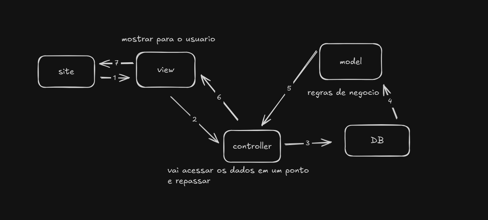

## ESQUEMA DO MVC 

# esquema do projeto

/classe 
    -Controller
    -Model
    -Views
/css
.config <-- configuraçoes gerais -->
.index

# MVC 
estou estudando novamente o uso do MVC nos projeto, uma forma que eu usei para entender melhor e bem ditatica foi, "A views pede para controller o controller acessa o banco para criar a lista de modelos e devolve para ela mostrar na tela "; 